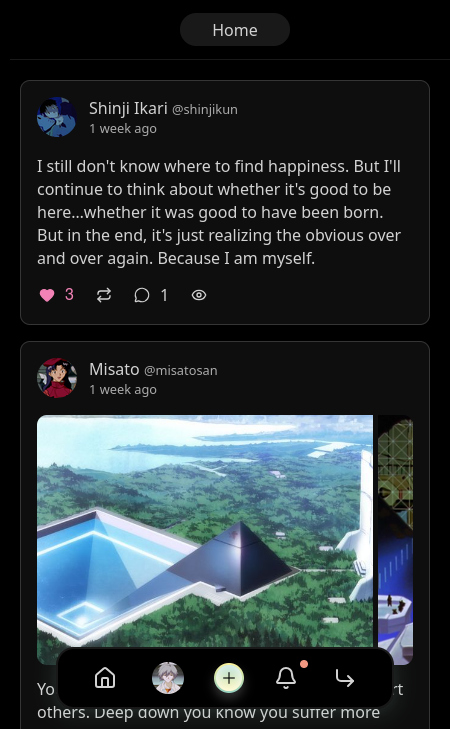
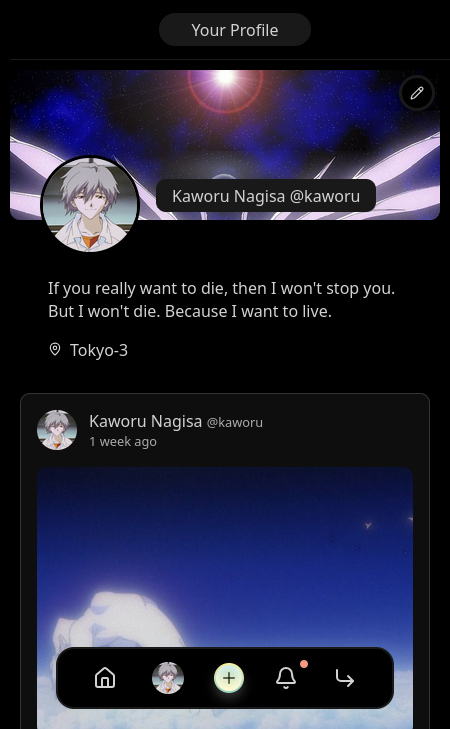

# Tomleb

A full-stack social platform built with modern web technologies.

<p>
  
  &nbsp;&nbsp;
  
</p>

## Tech Stack

**Frontend:** SvelteKit, Svelte 5, TypeScript

**Backend:** Hono, Bun, Drizzle ORM, SQLite

## Features

- Authentication (register, login, logout)
- Posts with image uploads and likes
- Comments and threaded replies
- User profiles

## Running locally

**Backend**
```bash
cd server
bun install
bun run dev
```

**Frontend**
```bash
cd client
bun install
bun run dev --open
```

